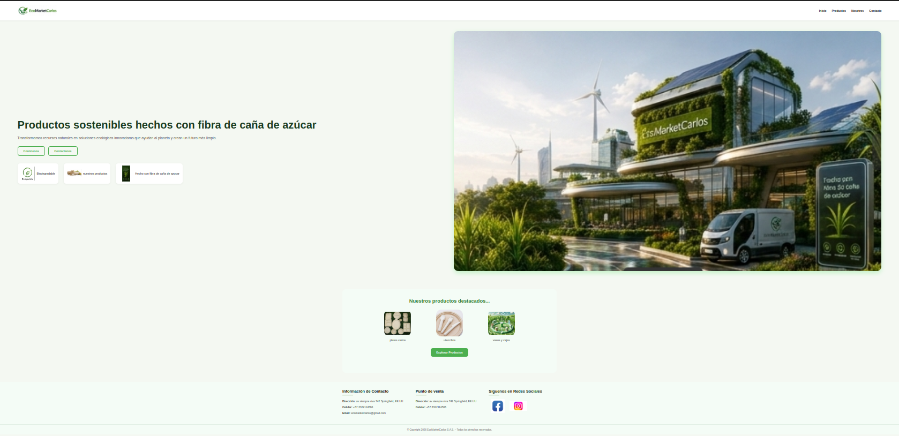
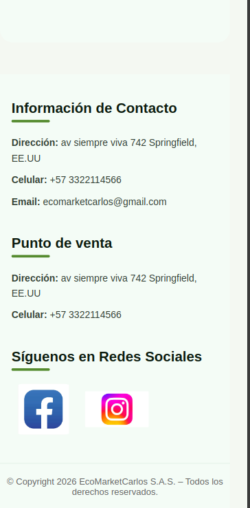
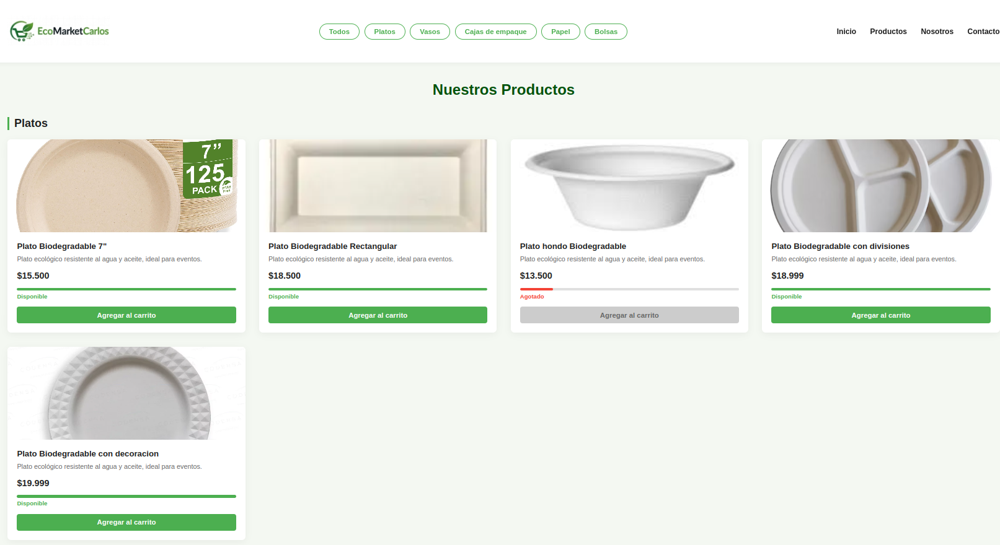
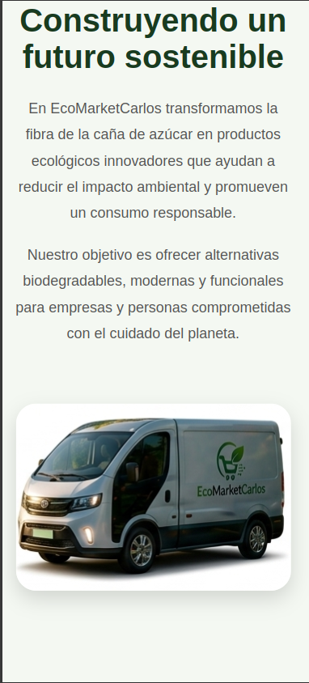
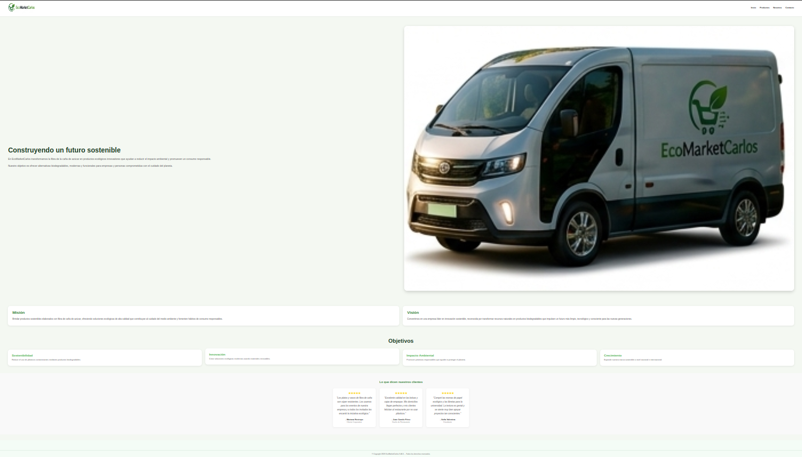
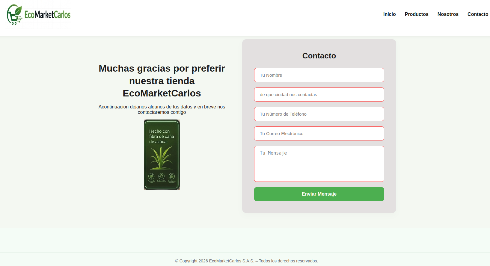
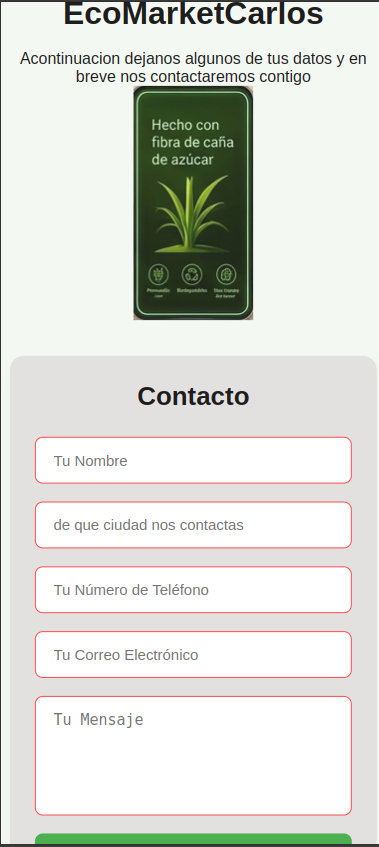

# EcoMarketCarlos 🌿🛒

¡Bienvenido a **EcoMarketCarlos**! Este es un sitio web diseñado para una tienda ecológica eco-friendly,
enfocado en la promoción y comercialización de productos biodegradables y compostables (como platos, vasos, cajas de empaque, papel y bolsas)
fabricados a partir de materias primas sostenibles como la fibra de caña de azúcar.

## 📝 Descripción del Proyecto

El objetivo principal de este proyecto es ofrecer una interfaz web atractiva,
intuitiva y rápida para que los usuarios puedan explorar un catálogo completo de productos ecológicos. 

### Características principales:
* **Catálogo Organizado:** Distribución de productos por categorías claras (Platos, Vasos, Cajas, Papel, Bolsas).
* **Sistema de Filtrado Inteligente:** Implementación de un sistema de navegación por pestañas y filtros dinámicos
*  utilizando puramente CSS moderno (`:target` y `:has`).
* **Diseño Responsivo (Responsive Design):** Estructura adaptable mediante CSS Grid y Flexbox,
*  asegurando que la tienda se visualice correctamente tanto en computadoras de escritorio como en dispositivos móviles.
* **Formularios Seguros:** Sección de contacto con estructura de captura de datos optimizada.

---

## 🛠️ Tecnologías Utilizadas

Para el desarrollo de esta plataforma se utilizaron tecnologías web estándar, priorizando un código limpio,
modular y un rendimiento óptimo sin dependencias pesadas:

* **HTML5:** Estructuración semántica del contenido, manejo de formularios y enlaces de anclaje para la navegación interna.
* **CSS3:** Estilos personalizados, diseño de productos mediante **CSS Grid**,
*  alineación fluida con **Flexbox**, efectos visuales de desborde (`overflow: hidden`) y la lógica lógica del filtrado interactivo.

---

## 👁️ Instrucciones de Visualización

Para ver y explorar el proyecto de manera local en tu equipo, sigue estos sencillos pasos:

### Opción 1: Clonar el repositorio (Recomendado)
1. Abre tu terminal (Git Bash, CMD o la terminal de tu preferencia).
2. Clona este repositorio ejecutando el siguiente comando:

git clone [https://github.com/carlosmariov98-hue/EcoMarket_CarlosVelasquez.git](https://github.com/carlosmariov98-hue/EcoMarket_CarlosVelasquez.git)

3. Abre la carpeta del proyecto en Visual Studio Code.

4. Busca el archivo index.html en el explorador de archivos izquierdo.

5. Haz clic derecho sobre index.html y selecciona "Open with Live Server" (o presiona el botón Go Live en la barra inferior de VS Code) para abrir tu navegador y visualizar pa pagina web.

---

### 🖥️ Vista de la Aplicación (Escritorio vs. Móvil)

| Sección | Vista Escritorio | Vista Móvil |
| :--- | :---: | :---: |
| **Inicio** |  |  |
| **Productos** |  |  |
| **Nosotros** |  |  |
| **Contacto** |  |  |

